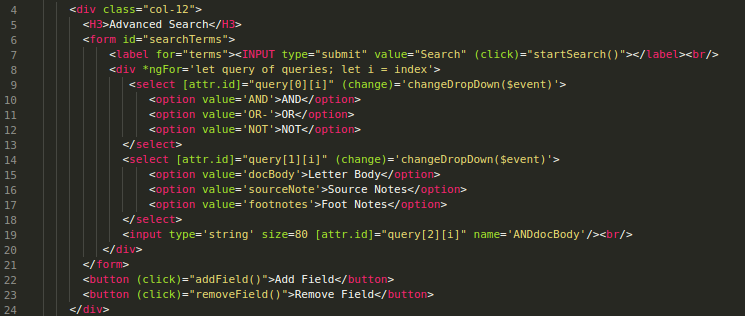
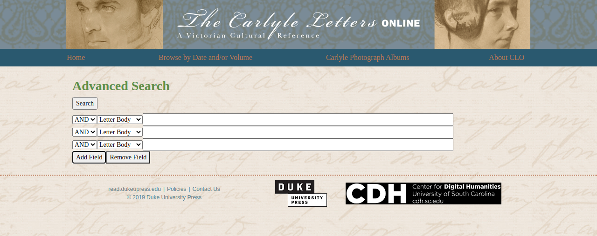
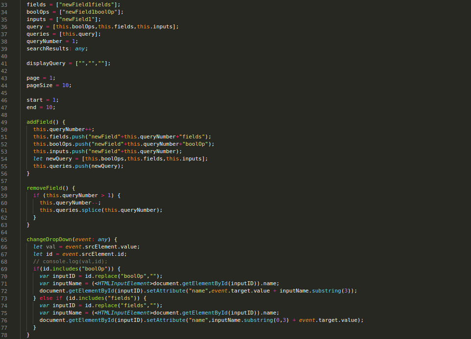
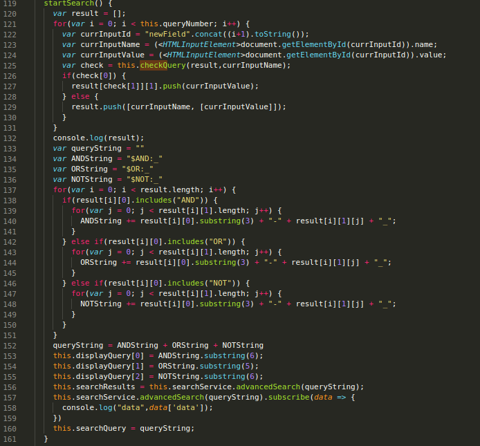
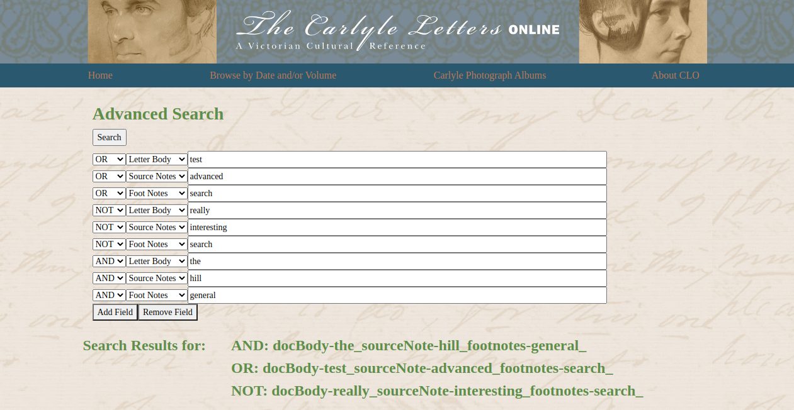

# How the Advanced Search in CLO works
## Angular (clo-angular/src/app/advanced-search/)
The front-end is split into the search and the results.
### Search
The advanced search page looks like this: 
 
And the underlying HTML is: 
 
The HTML goes through each query added to the array, which are displayed as separate fields: 
 
Each of these fields have their own ID to keep track of the order they were added. These are kept track of in the component.ts file. 
 
The addField method increments the queryNumber variable to keep track of how many queries there are and adds the appropriate attribute IDs to the query array. 
The removeField method decrements the queryNumber variable and removes the associated query from the array. 
The changeDropDown method updates the attribute ID of the text field when its associated drop down fields change value. 
### Results
When the user is ready to search, they click the button and the startSearch method is called: 
 
This method takes all the name attribute IDs from the text fields and the text in the fields and constructs a query string to send to the backend. It uses special characters to ensure the backend knows the difference between a search term and part of the query architecture. A modified version of this query string is displayed to the user with the results: 
 
When results are shown, it uses paging to show results 10 at a time.

## API
