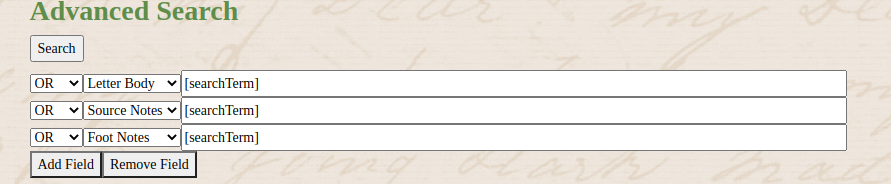
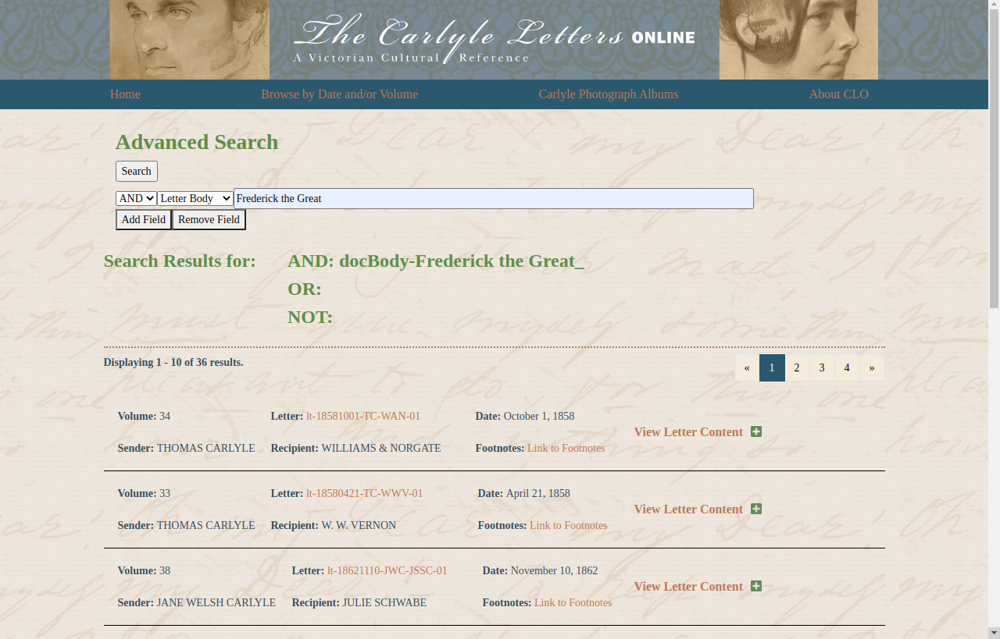
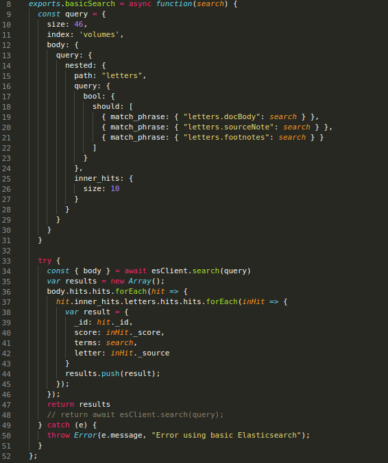
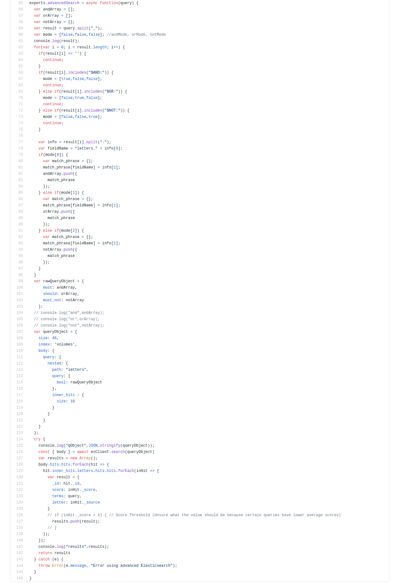

# How the Advanced Search in CLO works
This document will attempt to give a detailed explanation of how ElasticSearch is used in the CLO website, including going over the important files and code that make the Advanced Search work properly. 

This system was developed by Ian McDowell from November 2019-May 2020. Contact email: ianmcdowell24@gmail.com

## The Synchronization Script (clo-api/elasticSync.js)
The synchronization script first makes a MongoDB schema listing all the fields of letters and uses es_indexed and es_type: "nested" to ensure the data is moved into ElasticSearch appropriately. Then an ElasticJS mapping is made. When this happens, all volumes are looped through to remove the XML notation from the letter body, source notes, and footnotes so that when search queries are being processed, they aren't messed up by XML syntax characters. Then the volumeSynchronize method ensures all the letters are with the appropriate volumes, then pushes the volumes to the ElasticSearch database.

## Angular (clo-angular/src/app/advanced-search/)
The front-end is split into the search and the results.

### Search
The advanced search page looks like this: 
 
And the underlying HTML is: 
 
The HTML goes through each query added to the array, which is displayed as separate fields: 
 
Each of these fields has its own ID to keep track of the order they were added. These are kept track of in the component.ts file. 
 
The addField method increments the queryNumber variable to keep track of how many queries there are and adds the appropriate attribute IDs to the query array. 
The removeField method decrements the queryNumber variable and removes the associated query from the array. 
The changeDropDown method updates the attribute ID of the text field when its associated drop-down fields change value. 

#### Note on Basic Search
The basic search, which can be accessed from other pages, is programmed to do an equivalent search to this advanced search:
 

### Results
When the user is ready to search, they click the button and the startSearch method is called: 
 
This method first checks if the query is valid, mainly checking that a given search term is longer than one character. Then it takes all the name attribute IDs from the text fields and the text in the fields and constructs a query string to send to the backend. It uses special characters to ensure the backend knows the difference between a search term and part of the query architecture. A modified version of this query string is displayed to the user with the results: 
 
When results are shown, it uses paging to show results 10 at a time: 
 
Each of the results has relevant information about the letter including a preview of it and a link to the letter's page.

## API
Now in order for the advanced-search.component.ts file to get search results, it has to call on the clo api to send a query request to the ElasticSearch database.

### Elastic Service (clo-api/services/elastic.services.js)
We will start off by explaining the basic search since it is simpler to understand. 
 
The basic search and advanced search both use nested queries in order to search through the actual letters instead of the volumes themselves. The basic search query simply checks if a given term is in any of the letter fields (letter body, source notes, footnotes). The inner_hits size for both basic and advanced search is 10 as it appeared to give the most relevant results in testing, if a better value is found, feel free to change it.

#### IMPORTANT NOTE ABOUT QUERY SIZE
ANY TIME that a new volume is added, the query size MUST be updated to the total number of volumes in order for ElasticSearch to search all of the volumes. 

Once the query has been constructed, it is sent to ElasticSearch and the service awaits the results. For each of the results, the volume ID, ES score, search terms, and letter are all put together and added to an array of results to send to Angular. 

Now we will go over the advanced search, it is a similar process, but there are a few more steps in processing the query: 
 
The service starts with the formatted query string from the results section. It splits it at each search term and boolean operator. It then goes through the list and if it encounters a boolean operator, it will then change the processing mode to that boolean operator. Then all search terms until the next operator are added to an array as objects using match_phrase. Once this processing has been done, we get a raw query that puts the appropriate AND, OR, and NOT search terms into the appropriate must, should, and must_not fields. Then this raw query is added to the nested query structure. The results are handled the same as the basic search.

#### Unresolved issue with ElasticSearch Scores
Due to a lack of filter for low-scoring results, sometimes the advanced search will return an absurd amount of results. A more detailed description of the issue and a theoretical solution is in the ElasticDocumentation.md file under "Note about ElasticSearch result scores".

### Elastic Model (clo-api/models/elastic.model.js)
The elastic model should only be changed if the structure of the volumes in the Mongo database is changed or the queries searched by the advanced search are expanded.

## Optimizations
The two biggest optimizations that I see are the synchronization script and how Angular hands the query to the API (query string). This system was cobbled together with a lot of research and coding interspersed over a 6 month period so if after learning more about the system you find a better or cleaner way to do any of this, please feel free to change it.